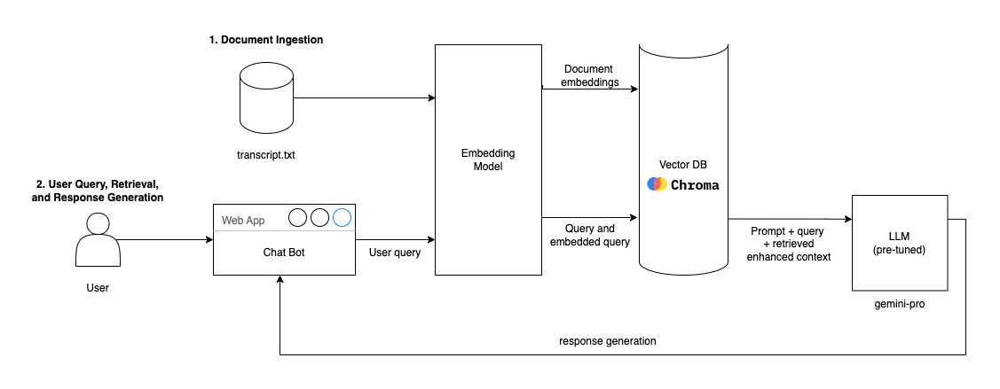

# SpamBot - Your Daily Activity Summarizer 📋✨

**Live Demo 🚀: [SpamBot](https://spambot.streamlit.app)**
### Tools and Technologies 🛠️
- **Language**: Python
- **Libraries**: Streamlit, Transformers, Langchain, ChromaDB and Google AI Studio
- **Models**: `gemini-pro`, `bart-large-cnn` and `distilbert-base-cased-distilled-squad`

## Background
SpamBot is an integral part of a VR-based project designed to help users summarize their daily activities and perform QA tasks. It aims to enhance productivity and assist in recalling minutes of meetings. Initially, we developed a VR-based multilingual speech-to-text transcriber and intended to integrate SpamBot with it. However, we encountered challenges in connecting these technologies.

## What is SpamBot? 🤖
SpamBot is a standalone application that takes a `transcript.txt` file as input, allowing users to perform QA and summarization tasks. This makes it easier to summarize lengthy conversations and recall important meeting details.

## System Architecture 🏗

**Fig 1**: Basic RAG pipeline using Langchain.

## Description 📜
- **qachat.py**: Contains foundational transformers like `facebook/bart-large-cnn` for summarization and `distilbert-base-cased-distilled-squad` for QA. Due to the foundational nature of these models, their results were not very accurate. Hence, we upgraded to using `gemini-pro` for QA and `t5-base` for summarization.
- **main.py**: The core file of the application, utilizing `gemini-pro` for both QA and summarization tasks. Users can input a `transcript.txt` file to perform these tasks.
- **requirements.txt**: Lists all the necessary libraries to run the application.

## How to Run? 🚀
1. Clone the repository.
2. Install the required libraries using the command: `pip install -r requirements.txt`
3. Save your API key in a `.env` file.
4. Run the `main.py` file on Streamlit using the command: `streamlit run main.py`

> **Note**: 
> * You can modify the `transcript.txt` file to test the application with different inputs.
>
> * Feel free to test the `qachat.py` file with different models and transformers to explore more functionalities.

## Future Work 🛠️
- Integrate SpamBot with the VR-based transcriber.
- Enhance the summarization and QA models for improved accuracy.
- Add more functionalities like speech-to-text conversion and text-to-speech synthesis.

Let's make your daily activities more manageable with SpamBot! 🌟